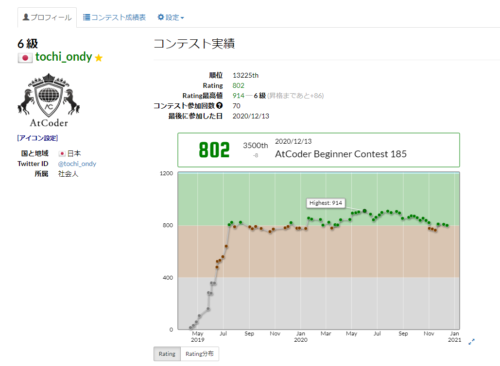
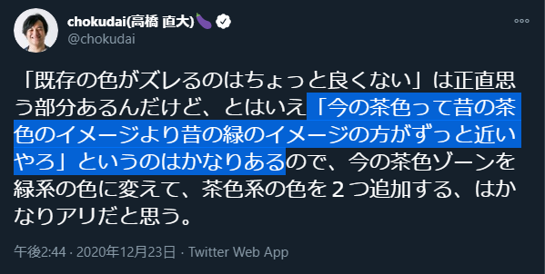
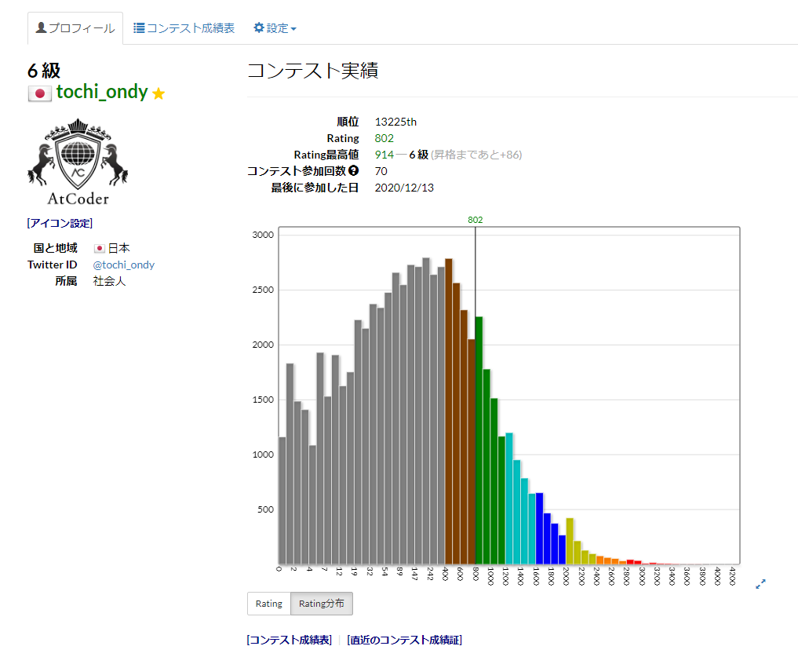

# 2人育児しながらAtCoder続けて緑になった

2020-12-29 [@tochi_ondy](https://twitter.com/tochi_ondy)

---

  
  

---

## 小さい子供が2人もいると自由な時間がなかなかとれません。。

---

## 土日夜も呑みに行けない。。

### (そこにコロナが拍車をかける。。）
---

## しかし！

---

---

## 子供を寝かしつければ自由な時間！

---

---

## 子供が寝る夜8-9時以降に何ができるか。。？

---

https://atcoder.jp/

---

## ということで、AtCoderを1年以上続けてみました

---

## ちなみに土日夜遊びに行かなくなったので今の方がAtCoderをやりやすいです

(あくまで自分の場合)

---

---

## 横ばい。かろうじて緑。。しかし

---

　　　
---

## 今のAtCoderは難しくなってるので成長はしてるでしょう。。（と信じたい）

---

---

## AtCoderをなぜやるか

- **なんか楽しい**
- スキルアップ
- 社外でスキルが可視化される
- 仕事でなかなかコーディングできない
- Computer Scienceにちょっと興味あった

---

## AtCoderの自分流やり方

- **基本コンテストにのみ挑む**
  - 過去問たくさん解いてから挑む方がRating上げるのに効率良いとは思う
  - コンテストでしくじったときの方が頭の中に残りやすく、学習としてよい
  - 競技プログラミングだけに時間を全振りしたくないのでABC/ARCのある土日夜1回のみ

---

## 家庭との両立

- 役割分担
  - 私: 上の子寝かしつけ
  - 妻: 下の子寝かしつけ
- AtCoderで家庭崩壊したくないので
  - 妻の了承をもらいつつも、家庭を優先
  - 家事はコンテスト前後で済ませる

---

## 育児AtCoderあるある

- 子供が昼寝たっぷりして、コンテスト開始夜9時の時点で起きてる
  - なんとか寝かしつけて、出遅れて開始
  - 子供の相手をしつつ、開始
- 寝たと思った子供が突如起きる
  - 再度寝かしつけてから再開
  - そのせいでD, E問題提出が遅れ、コンテスト終了5分後にできて悔しい思いしたことあり

---

## 身についた力 (1/3)

- **コーディングの際、計算量・計算効率・実行時間を考える習慣がついた**
- **データ量とアルゴリズムによって実行時間が大きく変わるのが肌感覚でわかるようになった**

---

## 身についた力 (2/3)

- アルゴリズム
  - 累積和、幅優先探索、深さ優先探索、2分探索、動的計画法、UnionFind木、imos法など
- Pythonライブラリの使い方・適用方法
    - Counter, defaultdict, deque, heapq, bisect, lru_cache, itertoolsなど

---

## 身についた力 (3/3)

- 子供の寝かしつけ力
  - コンテスト日に子供が早く寝るよう昼に子供を遊ばせる量と昼寝時間の調整
  - とはいえ、そんなにうまくいかない

---

## いつまでやるか

- やれば伸びそうな内はやり続けたい
- 水・青色くらいまではなんとなく目指したい

---

## そのためには (来年！？)

- 今はABCのD問題までやってるけど、E, F 問題も解く
- 積んでる競技プログラミング本を読む
  - チーター本、蟻本、けんちょん本など
